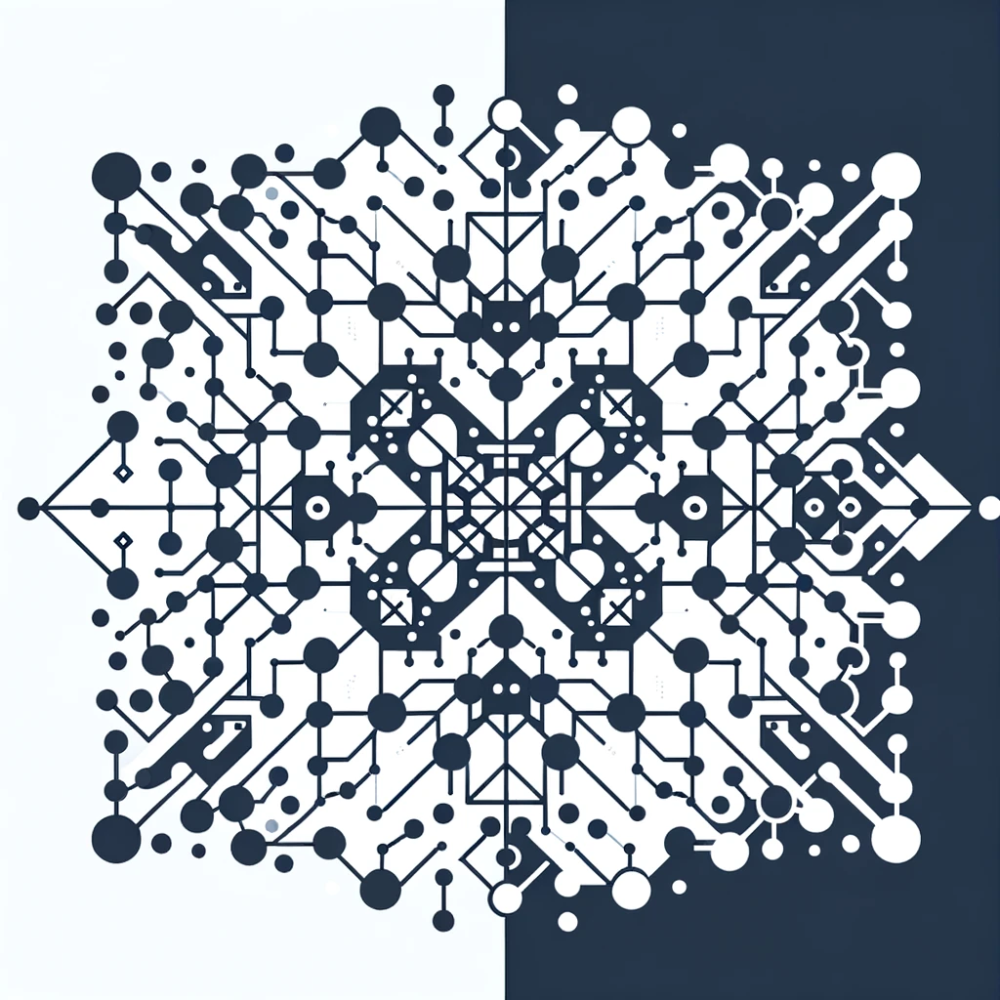

# FractalNet

## Overview
FractalNet is an innovative project aimed at exploring the intersection of fractal-based neural networks and transformers. This approach seeks to harness the repetitive, self-similar properties of fractals to create neural network architectures that are potentially infinite, more efficient, or capable of achieving better performance on various tasks. The project is in its early stages, focusing on the design, implementation, and evaluation of these novel neural network models.

## Key Features
- **Fractal-Based Architecture:** Utilizes the principles of fractals to design neural network structures.
- **Innovative Neural Networks:** Aims to develop neural networks that can potentially outperform traditional architectures in terms of efficiency and scalability.
- **Open Source:** Encourages collaboration and contribution from the open-source community.